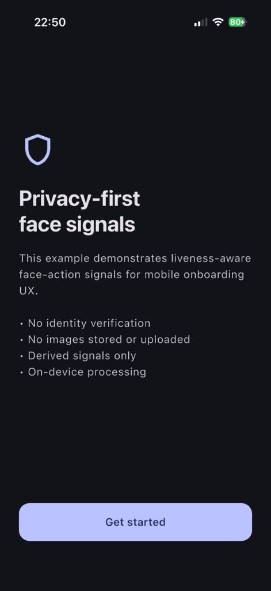
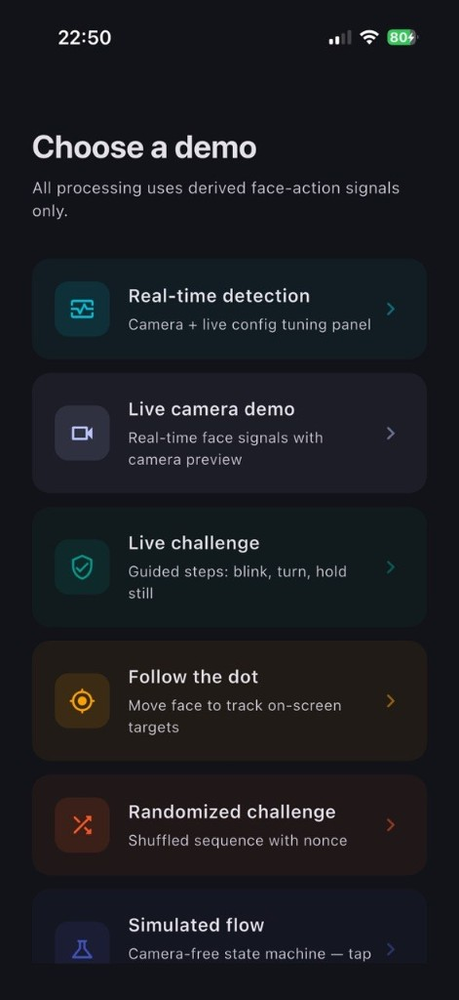
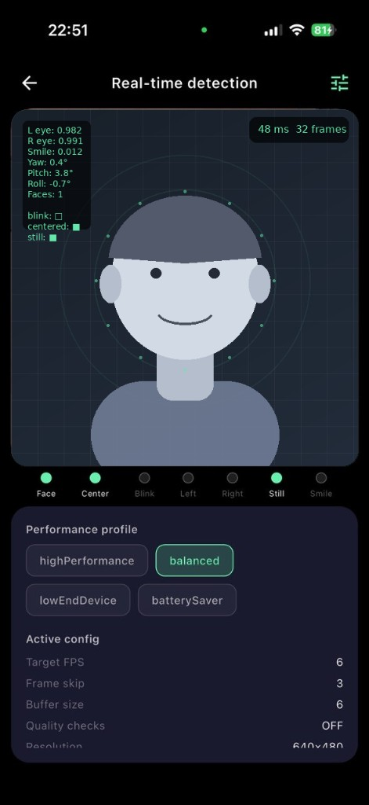
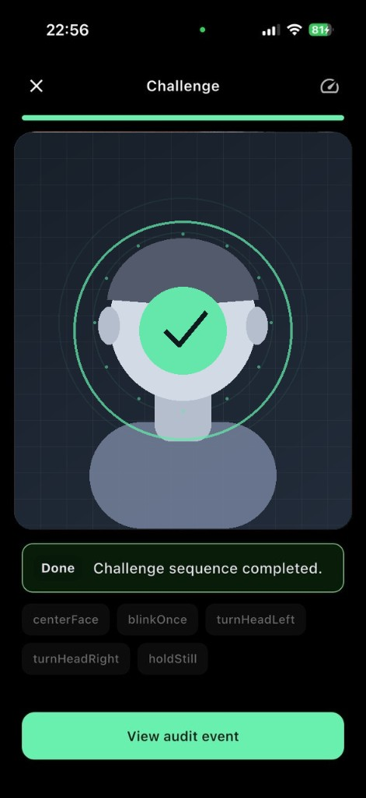
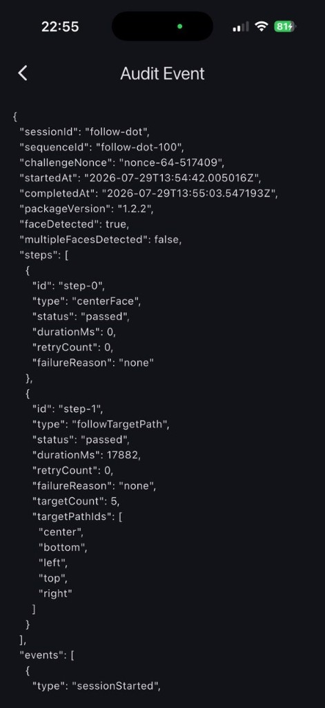

# flutter_liveness_actions

[](https://pub.dev/packages/flutter_liveness_actions)
[](https://github.com/pvlKryu/flutter_liveness_actions/actions/workflows/ci.yml)
[](LICENSE)

Liveness-aware face action helpers for Flutter mobile apps using Google ML Kit Face Detection.

`flutter_liveness_actions` helps Flutter developers build liveness-aware face-action challenge flows using Google ML Kit Face Detection. It provides reusable helpers for blink detection, head movement detection, face positioning, quality gates, challenge-state management, performance throttling, guidance messages, diagnostics, and audit-friendly onboarding events.

**Stable API:** `1.x` — see [doc/API.md](doc/API.md) and [doc/STABILITY.md](doc/STABILITY.md). Additive features such as 1.1.0 target paths and 1.2.0 security/jitter gates remain SemVer-compatible.

**This package is not an identity verification, biometric authentication, KYC, AML, fraud-prevention, or credit-decisioning SDK.** It only provides derived interaction signals and challenge-flow utilities.

## What this package does

- Converts ML Kit face output into normalized `FaceActionFrame` values
- Derives onboarding interaction signals (blink, head turn, face position, hold still)
- Smooths noisy detector output with temporal buffers and hysteresis
- Evaluates face quality gates for challenge readiness
- Runs configurable challenge sequences with progress and events
- Throttles frame processing for lower-end Android devices
- Builds privacy-safe, demo-oriented audit events (no raw images)
- Exposes accessibility-friendly guidance metadata for your UI

## What this package does not do

- Identity verification or biometric authentication
- Face comparison or person identification
- KYC, AML, fraud prevention, or credit decisioning
- Raw image storage or upload (by design)
- Web, desktop, macOS, Windows, or Linux support (Android/iOS only)

## Why this package exists

Camera-based onboarding prototypes often reimplement the same layers: adapter → smoothing → quality gate → challenge state machine → UX guidance. This package extracts that production-oriented pipeline into testable pure Dart logic for Android and iOS mobile apps.

## Architecture overview

```
Camera / ML Kit (app-owned)
        ↓
MlKitFaceAdapter → FaceActionFrame
        ↓
LivenessActionSession
  FrameProcessingController → FaceActionAnalyzer → ChallengeFlowController
  GuidanceMessageBuilder → AuditEventBuilder
        ↓
LivenessActionSnapshot / OnboardingAuditEvent
```

See [doc/ARCHITECTURE.md](doc/ARCHITECTURE.md), [doc/API.md](doc/API.md), and [doc/STABILITY.md](doc/STABILITY.md).

## Screenshots

<p align="center">
  
  
  
</p>

<p align="center">
  
  
</p>

<p align="center"><sub>Example screenshots use a schematic face placeholder — no real biometric imagery is shown.</sub></p>

## Installation

```yaml
dependencies:
  flutter_liveness_actions: ^1.3.1
  google_mlkit_face_detection: ^0.14.0
```

## Android setup

Add camera permission to `android/app/src/main/AndroidManifest.xml`:

```xml
<uses-permission android:name="android.permission.CAMERA" />
```

Ensure `minSdkVersion` meets ML Kit and camera plugin requirements (typically 21+).

## iOS setup

Add to `ios/Runner/Info.plist`:

```xml
<key>NSCameraUsageDescription</key>
<string>Camera is used for on-device face action signal processing during onboarding demos.</string>
```

## Quick start

Preferred integration uses `LivenessActionSession`:

```dart
import 'package:flutter_liveness_actions/flutter_liveness_actions.dart';

final session = LivenessActionSession(
  enableChallenge: true,
  sessionId: 'onboarding-1',
);

// After ML Kit returns faces for an accepted camera frame:
if (!session.acceptFrame(DateTime.now())) return;
session.markProcessingStarted();
final started = DateTime.now();
final frame = const MlKitFaceAdapter().fromFaces(faces, imageSize: imageSize);
final snap = session.completeFrame(frame, DateTime.now().difference(started));
// Use snap.guidance / snap.challengeState / snap.diagnostics
```

Lower-level building blocks remain available:

```dart
final adapter = MlKitFaceAdapter();
final analyzer = FaceActionAnalyzer();
final challenge = ChallengeFlowController();

final frame = adapter.fromFaces(faces, imageSize: imageSize);
final result = analyzer.analyze(frame);
challenge.processSignal(result.signal);
```

## ML Kit adapter example

```dart
final adapter = MlKitFaceAdapter();
final frame = adapter.fromFace(face, imageSize: Size(width, height));
```

## Challenge flow example

```dart
final controller = ChallengeFlowController();
controller.events.listen((event) {
  // Handle stepPassed, challengeCompleted, etc.
});
controller.processSignal(result.signal);
```

Default sequence: center face → blink once → turn left → turn right → hold still.

## Performance profiles

| Profile | Target FPS | Notes |
|---------|------------|-------|
| `highPerformance` | 20 | More checks, larger buffers |
| `balanced` | 12 | Default recommendation |
| `lowEndDevice` | 8 | Smaller buffers, fewer checks |
| `batterySaver` | 6 | Minimal processing |

```dart
final fps = FrameProcessingController(config: PerformanceConfig.lowEndDevice());
```

Use `AdaptivePerformanceController` to switch profiles from runtime latency/drop-rate with confirmation hysteresis:

```dart
final adaptive = AdaptivePerformanceController();
adaptive.observe(frameController.diagnostics());
frameController.updateConfig(adaptive.config);
```

## Low-end Android recommendations

Optimized for a wide range of Android devices, including lower-end phones, subject to platform and camera plugin limitations.

- Use `PerformanceConfig.lowEndDevice()` or `batterySaver()`
- Process one frame at a time (`maxInFlightFrames: 1`)
- Prefer lower analysis resolution (640×480)
- Disable extended quality checks when not needed
- Monitor `LivenessDiagnostics` and adapt profiles

## Guidance messages

`GuidanceMessageBuilder` returns metadata (code, severity, default text, semantic labels, haptic hints) for your UI — no widgets are forced by the package.

Guidance uses stable `messageKey` values from `GuidanceCatalog` for localization:

```dart
final messages = GuidanceMessageBuilder().fromSignal(signal);
final text = messages.first.resolveText((key) => lookupLocalized(key));
```

Each `GuidanceMessage` also carries accessibility metadata (`semanticLabel`, `announceForAccessibility`, `highContrastLabel`, `canUseHapticFeedback`).

## Dynamic target challenges (follow-the-dot)

Follow-the-dot challenges are implemented as face-center target tracking, not eye tracking. The package evaluates whether the detected face bounding-box center enters target zones over time. This can help create richer real-time onboarding interactions, but it does not prove identity or prevent spoofing by itself.

```dart
final targetPath = DefaultTargetPaths.simpleCross();
final evaluator = TargetPathEvaluator(targets: targetPath);
final result = evaluator.processFrame(frame);
```

Challenge presets:

- `DefaultChallenges.basic()` — classic center / blink / turn / hold
- `DefaultChallenges.lowEndFriendly()` — center / blink / hold
- `DefaultChallenges.extended()` — adds smile + simple target path

For low-end Android devices, prefer low-end-friendly challenges, larger target zones, fewer target steps, and `PerformanceConfig.lowEndDevice()`.

See [doc/DYNAMIC_CHALLENGES.md](doc/DYNAMIC_CHALLENGES.md) and [doc/THREAT_MODEL.md](doc/THREAT_MODEL.md).

## Randomized challenge sequences

Use `ChallengeSequenceFactory` with `randomize: true` and an optional seed for reproducible step order:

```dart
final sequence = const ChallengeSequenceFactory().create(
  FaceChallengeConfig(
    randomize: true,
    seed: 42,
    maxSteps: 4,
    requireCenterFaceFirst: true,
  ),
);
```

## Audit trail

`AuditTrailRecorder` records a privacy-safe timeline of session events. Pass it to `AuditEventBuilder` to include `events` in the audit JSON:

```dart
final auditBuilder = AuditEventBuilder(
  sessionId: 'demo',
  sequenceId: sequence.sequenceId,
  packageVersion: packageVersion,
  trailRecorder: AuditTrailRecorder(),
)..recordCameraReady();
```

```json
{
  "sessionId": "demo-session-123",
  "rawImagesStored": false,
  "identityDecision": "not_performed",
  "creditDecision": "not_performed",
  "demoOnly": true,
  "privacy": {
    "rawImagesStored": false,
    "rawImagesUploaded": false,
    "derivedSignalsOnly": true
  }
}
```

## Privacy principles

- Derived signals only by default
- No raw image storage or upload from core APIs
- No backend required
- Audit events include explicit privacy flags
- See [PRIVACY.md](PRIVACY.md)

## Limitations

- Android and iOS only in v1.3.1
- Follow-the-dot is face-center tracking — not eye tracking or gaze estimation
- Heuristic quality checks (brightness/blur) are limited where noted
- Not validated for regulated identity use cases
- Device and camera compatibility varies — see [doc/DEVICE_TESTING.md](doc/DEVICE_TESTING.md) and [doc/PLATFORM.md](doc/PLATFORM.md)

## Roadmap

- **0.1.0** — Core pipeline, example app, initial tests
- **0.2.0** — Adaptive profiles, improved quality gate, lifecycle handling, live camera example
- **0.3.0** — Randomized challenges, accessibility hooks, localization-ready guidance, audit trail
- **0.5.0** — Session facade, API review docs, device testing checklist, live challenge example
- **0.9.0** — Release candidate, stable public API freeze candidate
- **1.0.0** — Stable API
- **1.0.1** — Release-readiness patch (LICENSE, stuck-frame fix, platform camera formats)
- **1.1.0** — Dynamic target / follow-the-dot challenges + simulator
- **1.2.0** — Multi-face security gate, face jitter filter, enriched audit
- **1.2.1** — Formatting fix for publish / CI
- **1.2.2** — Version metadata sync
- **1.3.0** — Blink reliability, challenge quality-gate fix, richer example demos
- **1.3.1** — Docs polish and example screenshots (current)

Post-1.0 work focuses on patch/minor improvements, device validation as dependencies evolve, and optional host-app demos — not breaking API churn.

## Contributing

See [CONTRIBUTING.md](CONTRIBUTING.md).

## License

MIT — see [LICENSE](LICENSE).

## Disclaimer

See [DISCLAIMER.md](DISCLAIMER.md). This package is intended for demos, prototypes, research, and mobile onboarding UX helpers unless properly reviewed by qualified teams.
